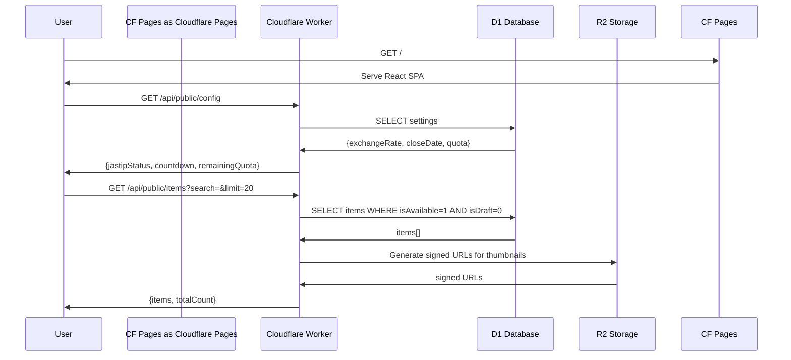
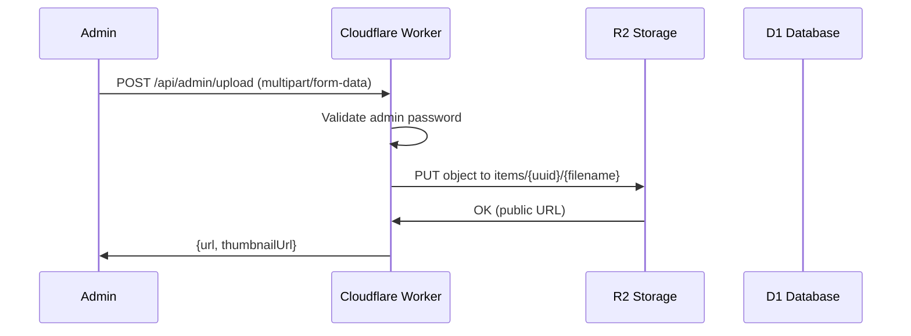
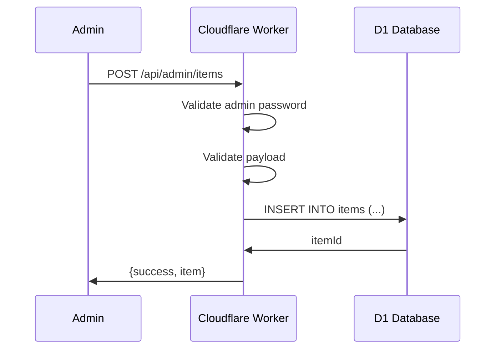

# Technical Design: Phase 1 - Core System

## 1. Architectural Overview

### System Design
Single-page React application deployed to Cloudflare Pages, with API served via Cloudflare Workers. All data stored in D1 (SQLite) and media in R2. No external auth provider in Phase 1 (simple password for admin).

### Key Decisions

| Decision | Rationale |
|----------|-----------|
| **Cloudflare Native Stack** | Free tier generous, edge-deployed, low latency for Indonesia |
| **D1 SQLite** | ACID transactions for quota counting, zero external dependencies |
| **R2 for Photos** | S3-compatible, no egress fees, integrated with Workers |
| **React SPA** | Single codebase, client-side routing, fast subsequent loads |
| **Server-Side Rendering (optional)** | Can add later for SEO; Phase 1 is private anyway |
| **Admin Password Auth** | Simple, no OAuth complexity for Phase 1 |
| **Fake "X people viewing"** | Randomized client-side display (no real WebSocket needed) |

### Tradeoffs
- **D1 vs External DB**: D1 is beta but sufficient; can migrate later if needed
- **Client-side search vs API search**: Client-side for <100 items; API filter when catalog grows
- **Direct R2 upload vs Worker proxy**: Worker proxy for auth + URL signing

---

## 2. Data Flow Diagram

### Landing Page Load


### Admin Upload Photo


### Admin Create Item


---

## 3. Component & Interface Definitions

### TypeScript Interfaces

```typescript
// Settings (Singleton)
interface Settings {
  id: 'default';
  exchangeRate: number;        // JPY to IDR, e.g., 108.5
  defaultMarginPercent: number; // e.g., 30 for 30%
  totalBaggageQuotaGrams: number; // e.g., 20000 for 20kg
  jastipStatus: 'open' | 'closed';
  jastipCloseDate: string | null; // ISO date
  estimatedArrivalDate: string | null; // e.g., "6-10 May 2025"
  adminPasswordHash: string;    // bcrypt hash
  updatedAt: string;
}

// Item
interface Item {
  id: string;                   // UUID
  name: string;
  description: string | null;
  photos: string[];             // R2 public URLs
  basePriceYen: number;
  sellingPrice: number;         // IDR
  weightGrams: number;
  
  // Info Box Flags
  withoutBoxNote: boolean;      // Show "tanpa box" info
  isLimitedEdition: boolean;    // Show "Limited Edition" badge
  isPreorder: boolean;          // Show "Pre-order" info
  isFragile: boolean;           // Show "Fragile" warning
  
  maxOrders: number;
  currentOrders: number;
  isAvailable: boolean;         // Soft delete
  isDraft: boolean;             // Draft mode
  createdAt: string;
  updatedAt: string;
}

// Public Item View (DTO)
interface PublicItem {
  id: string;
  name: string;
  description: string | null;
  photos: string[];
  sellingPrice: number;
  weightGrams: number;
  withoutBoxNote: boolean;
  availableSlots: number;       // maxOrders - currentOrders
  badge: 'available' | 'low_stock' | 'full' | 'new';
}

// Public Config Response
interface PublicConfig {
  jastipStatus: 'open' | 'closed';
  countdownDays: number | null;
  remainingQuotaKg: number;
  totalQuotaKg: number;
  estimatedArrivalDate: string | null; // e.g., "6-10 May 2025"
}

// API Response Wrapper
interface ApiResponse<T> {
  success: boolean;
  data?: T;
  error?: string;
}
```

### React Components

```typescript
// Landing Page
interface LandingPageProps {}

// Components
- Header: Displays countdown, quota status
- SearchBar: Real-time filtering with debounce
- ItemGrid: Responsive grid of ItemCard
- ItemCard: Thumbnail, name, price, weight, badge
- ItemDetailModal: Photo gallery, info box, specs
- FakeViewers: "X people viewing" randomized display

// Admin Panel
- AdminLogin: Password form
- AdminLayout: Sidebar navigation
- ItemList: Table/card list with actions
- ItemForm: Create/edit with validation
- PhotoUploader: Drag-drop, preview, R2 upload
- SettingsForm: Exchange rate, quota, close date, arrival date
```

### Info Box Component System

Items can display contextual info boxes to highlight important details. These appear in the item detail view with consistent styling (icon + colored background + optional description).

| Type | Icon | Color | Trigger |
|------|------|-------|---------|
| **Tanpa Box** | 📦❌ | Amber | `withoutBoxNote = true` |
| **Limited Edition** | ⭐ | Purple | `isLimitedEdition = true` |
| **Pre-order** | ⏰ | Blue | `isPreorder = true` |
| **Fragile** | 🥚 | Red | `isFragile = true` |
| **Best Seller** | 🔥 | Orange | Auto: top 3 most ordered |
| **Last Stock** | ⚠️ | Yellow | Auto: `availableSlots <= 2` |

**Example:**
```
┌──────────────────────────────────────────┐
│  📦❌  Dikirim tanpa box/dus            │  Amber bg
│        Untuk menghindari pajak bea cukai  │
├──────────────────────────────────────────┤
│  ⭐     Limited Edition                  │  Purple bg
│        Stok terbatas, siapa cepat dia    │
│        dapat!                             │
└──────────────────────────────────────────┘
```

---

## 4. API Endpoint Definitions

### Public Endpoints (No Auth)

#### GET /api/public/config
**Response:**
```json
{
  "success": true,
  "data": {
    "jastipStatus": "open",
    "countdownDays": 5,
    "remainingQuotaKg": 15.5,
    "totalQuotaKg": 20,
    "estimatedArrivalDate": "6-10 May 2025"
  }
}
```

#### GET /api/public/items
**Query Params:**
- `search`: string (optional, search name + description)
- `limit`: number (default: 20, max: 100)
- `offset`: number (default: 0)

**Response:**
```json
{
  "success": true,
  "data": {
    "items": [
      {
        "id": "uuid",
        "name": "Pokemon Snack Box",
        "description": "Limited edition",
        "photos": ["https://r2.../thumb.jpg", "https://r2.../full.jpg"],
        "sellingPrice": 85000,
        "weightGrams": 350,
        "withoutBoxNote": true,
        "availableSlots": 3,
        "badge": "new"
      }
    ],
    "total": 45
  }
}
```

### Admin Endpoints (Password Auth)

**Auth:** Bearer token in `Authorization: Bearer <admin_password>` header

#### POST /api/admin/login
**Body:** `{ password: string }`
**Response:** `{ success: true, token: string }` (same as password for Phase 1)

#### GET /api/admin/items
**Response:** Full item list with admin fields (basePriceYen, calculatedCost, etc.)

#### POST /api/admin/items
**Body:**
```json
{
  "name": "string",
  "description": "string?",
  "photos": ["string[]"],
  "basePriceYen": number,
  "sellingPrice": number,
  "weightGrams": number,
  "withoutBoxNote": boolean,
  "maxOrders": number,
  "isDraft": boolean
}
```

#### PATCH /api/admin/items/:id
**Body:** Partial item fields

#### DELETE /api/admin/items/:id
**Query:** `?force=true` for hard delete

#### POST /api/admin/upload
**Content-Type:** `multipart/form-data`
**Body:** `file: File`
**Response:** `{ url: string, thumbnailUrl: string }`

#### GET /api/admin/settings
#### PATCH /api/admin/settings

---

## 5. Database Schema (D1 SQLite)

```sql
-- Settings (single row)
CREATE TABLE settings (
  id TEXT PRIMARY KEY DEFAULT 'default',
  exchange_rate REAL NOT NULL DEFAULT 108.5,
  default_margin_percent INTEGER NOT NULL DEFAULT 30,
  total_baggage_quota_grams INTEGER NOT NULL DEFAULT 20000,
  jastip_status TEXT NOT NULL DEFAULT 'closed' CHECK (jastip_status IN ('open', 'closed')),
  jastip_close_date TEXT,
  estimated_arrival_date TEXT, -- e.g., "6-10 May 2025"
  admin_password_hash TEXT NOT NULL,
  updated_at TEXT NOT NULL DEFAULT CURRENT_TIMESTAMP
);

-- Items
CREATE TABLE items (
  id TEXT PRIMARY KEY,
  name TEXT NOT NULL,
  description TEXT,
  photos TEXT NOT NULL, -- JSON array of URLs
  base_price_yen INTEGER NOT NULL,
  selling_price INTEGER NOT NULL,
  weight_grams INTEGER NOT NULL,
  without_box_note INTEGER NOT NULL DEFAULT 0, -- SQLite boolean
  max_orders INTEGER NOT NULL DEFAULT 10,
  current_orders INTEGER NOT NULL DEFAULT 0,
  is_available INTEGER NOT NULL DEFAULT 1,
  is_draft INTEGER NOT NULL DEFAULT 0,
  created_at TEXT NOT NULL DEFAULT CURRENT_TIMESTAMP,
  updated_at TEXT NOT NULL DEFAULT CURRENT_TIMESTAMP
);

-- Indexes
CREATE INDEX idx_items_available ON items(is_available, is_draft) WHERE is_available = 1 AND is_draft = 0;
CREATE INDEX idx_items_search ON items(name, description); -- For FTS or LIKE queries

-- Triggers for updated_at
CREATE TRIGGER update_items_timestamp 
AFTER UPDATE ON items
BEGIN
  UPDATE items SET updated_at = CURRENT_TIMESTAMP WHERE id = NEW.id;
END;
```

---

## 6. Security Considerations

### Admin Authentication
- Simple password comparison (bcrypt hash stored in D1)
- No JWT/session — password sent with each request via Authorization header
- HTTPS only (Cloudflare enforces this)
- Rate limiting on `/api/admin/login` (Cloudflare WAF or Worker-level)

### File Upload
- Max file size: 5MB per photo
- Accept only: image/jpeg, image/png, image/webp
- R2 bucket: private, signed URLs generated by Worker
- Filename sanitization: UUID-based paths `items/{itemId}/{uuid}.{ext}`

### Input Validation
- All inputs validated with Zod schemas
- SQL injection prevented via parameterized queries (D1 bindings)
- XSS prevention: React escapes by default, sanitize descriptions if rendering HTML

### Data Privacy
- Base price (¥) never exposed in public APIs
- Admin endpoints return full data only with valid password

---

## 7. Test Strategy

### Unit Tests

**Core Logic:**
- `calculateCost(yen, rate)` → IDR
- `suggestSellingPrice(cost, margin%)` → IDR
- `calculateRemainingQuota(total, items[])` → grams
- `getItemBadge(createdAt, availableSlots, maxOrders)` → 'new' | 'low_stock' | etc.
- `searchItems(items[], query)` → filtered array

**Validation:**
- Item schema validation (Zod)
- Photo URL validation
- Price/weight bounds checking

### Integration Tests

**API Endpoints:**
- `GET /api/public/items` returns only available, non-draft items
- `GET /api/public/items?search=snack` filters correctly
- `POST /api/admin/items` creates item with correct calculated fields
- `PATCH /api/admin/settings` updates and reflects in public config
- Photo upload generates valid R2 URLs

**Database:**
- CRUD operations via D1 bindings
- Soft delete preserves data
- Index performance on search

### E2E/UI Tests

**Landing Page:**
- Search bar filters items in real-time
- Countdown displays correctly
- Quota bar updates after item created
- Item cards show correct badges
- "Tanpa box" info box displays with styling
- "X people viewing" shows randomized number

**Admin Panel:**
- Login with password grants access
- Create item form validates and submits
- Photo upload shows preview
- Draft items don't appear on landing page
- Settings update reflects immediately

**Mobile:**
- Responsive grid (1 col mobile, 3-4 desktop)
- Touch targets minimum 44px
- Photo gallery swipeable

---

## 8. Deployment Architecture

```
┌─────────────────────────────────────────────────────────────┐
│                    Cloudflare Infrastructure                │
├─────────────────────────────────────────────────────────────┤
│  Cloudflare Pages (React SPA)                               │
│  ├── Static assets (JS, CSS, images)                        │
│  └── Routes: /* → index.html (SPA routing)                  │
├─────────────────────────────────────────────────────────────┤
│  Cloudflare Workers (API)                                   │
│  ├── /api/public/* → Public endpoints                       │
│  ├── /api/admin/* → Protected endpoints                     │
│  └── R2 presigned URL generation                            │
├─────────────────────────────────────────────────────────────┤
│  Cloudflare D1 (SQLite)                                     │
│  └── Tables: settings, items                                │
├─────────────────────────────────────────────────────────────┤
│  Cloudflare R2 (Object Storage)                             │
│  └── Bucket: kotemon-jastip-photos                          │
│      └── items/{itemId}/{uuid}.jpg                          │
└─────────────────────────────────────────────────────────────┘
```

---

## 9. Future Considerations (Phase 2+)

**Phase 2 Additions:**
- Users table (Google OAuth ID, email, name)
- Orders table (userId, items[], totalWeight, status)
- Tokens table (code, usedBy, usedAt)

**Phase 3 Additions:**
- Analytics table or aggregate queries
- Inquiry items (isInquiry flag, no fixed price)

**Migration Path:**
- D1 supports ALTER TABLE for schema changes
- Zero-downtime deploys via Cloudflare

---

## 10. Environment Variables (Workers)

```bash
# Required
R2_BUCKET_NAME=kotemon-jastip-photos
R2_ACCOUNT_ID=xxx
R2_ACCESS_KEY_ID=xxx
R2_SECRET_ACCESS_KEY=xxx
D1_DATABASE_ID=xxx

# Optional (defaults in code)
DEFAULT_EXCHANGE_RATE=108.5
DEFAULT_MARGIN_PERCENT=30
DEFAULT_BAGGAGE_QUOTA_GRAMS=20000
```
