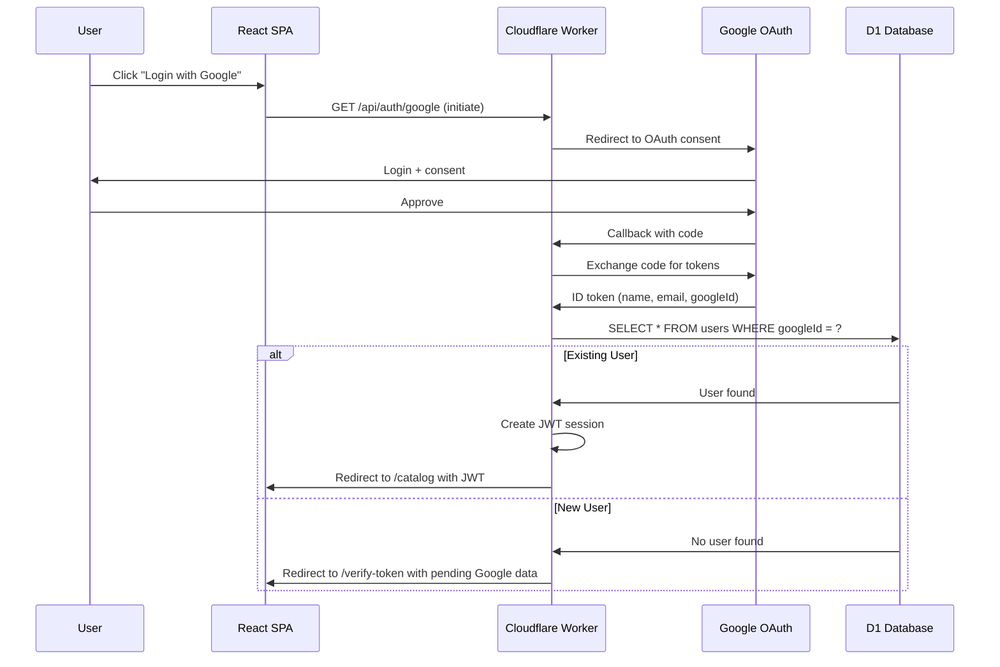

# Technical Design: Phase 2 - User Access

## 1. Architectural Overview

### System Design
Extend Phase 1 with user authentication and ordering. Add Google OAuth integration, session management, and order processing.

### Key Decisions

| Decision | Rationale |
|----------|-----------|
| **Google OAuth via Workers** | Server-side OAuth flow keeps client secret secure |
| **JWT Sessions** | Stateless, works across Cloudflare edge nodes |
| **Single-Page Cart** | Cart stored in React state + localStorage (no backend cart needed) |
| **Atomic Order Creation** | D1 transaction ensures quota consistency |

### New Components
- OAuth callback handler
- Token verification flow
- Order cart state management
- Order creation API

---

## 2. Data Flow Diagram

### New User Registration Flow


### Token Verification Flow


### Order Placement Flow


---

## 3. Component & Interface Definitions

### TypeScript Interfaces (New/Extended)

```typescript
// User
interface User {
  id: string;
  googleId: string;
  email: string;
  name: string;
  photoUrl: string;
  tokenId: string | null;
  createdAt: string;
  lastLoginAt: string;
}

// Token
interface Token {
  id: string;
  code: string; // KOTEMON-YYYY-XXXXXX
  createdBy: string; // Admin ID
  usedBy: string | null; // User ID
  usedAt: string | null;
  expiresAt: string | null;
  isRevoked: boolean;
  createdAt: string;
}

// Order
interface Order {
  id: string;
  userId: string;
  items: OrderItem[];
  totalWeightGrams: number;
  totalPrice: number;
  status: 'Confirmed' | 'Purchased' | 'Shipped' | 'Delivered';
  createdAt: string;
  updatedAt: string;
}

interface OrderItem {
  itemId: string;
  itemName: string; // Denormalized
  itemPhoto: string; // Denormalized
  quantity: number;
  priceAtTime: number;
  weightAtTime: number;
}

// Cart (Client-side only)
interface CartItem {
  itemId: string;
  item: PublicItem; // From Phase 1
  quantity: number;
}

// JWT Payload
interface JWTPayload {
  userId: string;
  email: string;
  iat: number;
  exp: number;
}
```

### React Components (New)

```typescript
// Auth Components
- GoogleLoginButton: Initiates OAuth flow
- TokenVerificationForm: Input token, validate, submit
- UserProfileMenu: Header dropdown with name, photo, logout

// Cart Components
- CartSidebar: Sliding drawer with cart items
- CartItemCard: Item thumbnail, name, qty, price, remove button
- OrderSummary: Total items, weight, price, quota check
- AddToOrderButton: On item cards, adds to cart

// Order Components
- OrderReviewPage: Full page order review before confirm
- OrderConfirmation: Success page with order ID
- OrderHistoryPage: List of user's past orders
- OrderDetailModal: View specific order details

// Contexts
- AuthContext: { user, login, logout, isLoading }
- CartContext: { items, addItem, removeItem, clearCart, totalWeight, totalPrice }
```

---

## 4. API Endpoint Definitions

### Auth Endpoints

#### GET /api/auth/google
**Description:** Initiate Google OAuth flow
**Response:** Redirect to Google consent screen

#### GET /api/auth/google/callback
**Query:** `?code=xxx&state=xxx`
**Response:**
- Existing user: Redirect to `/catalog` with JWT cookie
- New user: Redirect to `/verify-token?google=xxx` (encrypted temp data)

#### POST /api/auth/verify-token
**Headers:** `Content-Type: application/json`
**Body:** `{ tokenCode: string, googleData: EncryptedGoogleData }`
**Response:**
```json
{
  "success": true,
  "token": "jwt_token",
  "user": { "id", "name", "email", "photoUrl" }
}
```

#### POST /api/auth/logout
**Response:** `{ success: true }` (clears JWT cookie)

### Order Endpoints (Protected)

#### POST /api/orders
**Auth:** JWT cookie required
**Body:**
```json
{
  "items": [
    { "itemId": "uuid", "quantity": 2 }
  ]
}
```
**Response:**
```json
{
  "success": true,
  "data": {
    "orderId": "uuid",
    "totalWeight": 1250,
    "totalPrice": 170000,
    "status": "Confirmed"
  }
}
```

#### GET /api/orders/my
**Auth:** JWT cookie required
**Response:** List of user's orders

#### GET /api/orders/my/:id
**Auth:** JWT cookie required
**Response:** Single order with full details

### Public Endpoints (Extended from Phase 1)

#### GET /api/public/items
**Extended:** Now includes `availableSlots` calculation for logged-in users

---

## 5. Database Schema Additions (Phase 2)

```sql
-- Users table
CREATE TABLE users (
  id TEXT PRIMARY KEY,
  google_id TEXT UNIQUE NOT NULL,
  email TEXT UNIQUE NOT NULL,
  name TEXT NOT NULL,
  photo_url TEXT,
  token_id TEXT REFERENCES tokens(id),
  created_at TEXT NOT NULL DEFAULT CURRENT_TIMESTAMP,
  last_login_at TEXT NOT NULL DEFAULT CURRENT_TIMESTAMP
);

CREATE INDEX idx_users_google_id ON users(google_id);
CREATE INDEX idx_users_email ON users(email);

-- Tokens table (created by admin in Phase 3, used in Phase 2)
CREATE TABLE tokens (
  id TEXT PRIMARY KEY,
  code TEXT UNIQUE NOT NULL,
  created_by TEXT NOT NULL,
  used_by TEXT REFERENCES users(id),
  used_at TEXT,
  expires_at TEXT,
  is_revoked INTEGER NOT NULL DEFAULT 0,
  created_at TEXT NOT NULL DEFAULT CURRENT_TIMESTAMP
);

CREATE INDEX idx_tokens_code ON tokens(code);
CREATE INDEX idx_tokens_status ON tokens(used_by, is_revoked, expires_at);

-- Orders table
CREATE TABLE orders (
  id TEXT PRIMARY KEY,
  user_id TEXT NOT NULL REFERENCES users(id),
  total_weight_grams INTEGER NOT NULL,
  total_price INTEGER NOT NULL,
  status TEXT NOT NULL DEFAULT 'Confirmed' CHECK (status IN ('Confirmed', 'Purchased', 'Shipped', 'Delivered')),
  created_at TEXT NOT NULL DEFAULT CURRENT_TIMESTAMP,
  updated_at TEXT NOT NULL DEFAULT CURRENT_TIMESTAMP
);

CREATE INDEX idx_orders_user_id ON orders(user_id);
CREATE INDEX idx_orders_status ON orders(status);
CREATE INDEX idx_orders_created_at ON orders(created_at);

-- Order items (junction table)
CREATE TABLE order_items (
  order_id TEXT NOT NULL REFERENCES orders(id) ON DELETE CASCADE,
  item_id TEXT NOT NULL REFERENCES items(id),
  quantity INTEGER NOT NULL,
  price_at_time INTEGER NOT NULL,
  weight_at_time INTEGER NOT NULL,
  PRIMARY KEY (order_id, item_id)
);

CREATE INDEX idx_order_items_item_id ON order_items(item_id);
```

---

## 6. Security Considerations

### Google OAuth Security (@valuemelody/auth)
- Uses @valuemelody/auth built-in Google OAuth provider
- Handles state parameter and CSRF protection automatically
- Tokens verified against Google's JWKS
- Client secret stored in Worker environment

### Session Security
- @valuemelody/auth manages session tokens
- Expiration: 7 days (configurable)
- HttpOnly, Secure, SameSite=Lax cookies
- Automatic token refresh handling

### Token Verification Security
- Rate limit: 5 attempts per IP per 15 minutes
- Tokens are single-use and tracked
- Failed attempts logged (for admin review)

### Order Creation Security
- Transaction ensures atomic quota updates
- Validates all quotas before committing
- User can only create orders for themselves (userId from JWT)
- No price manipulation (prices fetched from DB, not trusted from client)

---

## 7. Test Strategy

### Unit Tests

**Auth:**
- Google OAuth callback validation
- JWT creation and verification
- Token code validation (exists, unused, not expired)

**Order Logic:**
- Quota calculation (item + baggage)
- Order total calculations
- Race condition handling (concurrent orders)

### Integration Tests

**API Endpoints:**
- Full OAuth flow (mocked Google)
- Token verification with valid/invalid tokens
- Order creation with quota checks
- Concurrent order attempts

**Database:**
- Transaction rollback on failure
- Foreign key constraints

### E2E/UI Tests

**User Flows:**
- New user: OAuth → Token verification → Catalog → Order
- Existing user: OAuth → Direct to Catalog
- Cart management (add, remove, update quantities)
- Order review and confirmation
- Order history viewing

**Error Cases:**
- Invalid token shows error
- Quota exceeded prevents order
- Race condition handled gracefully

---

## 8. Environment Variables (Workers - Additions)

```bash
# OAuth
GOOGLE_CLIENT_ID=xxx.apps.googleusercontent.com
GOOGLE_CLIENT_SECRET=xxx

# JWT
JWT_SECRET=random_32_char_string
JWT_EXPIRATION_DAYS=7
```

---

## 9. Deployment Notes

### Phase 2 Migration
1. Deploy new Worker code (backward compatible with Phase 1)
2. Run D1 migration (add users, tokens, orders tables)
3. Update React SPA (add auth flows)
4. Test OAuth flow in staging
5. Deploy to production

### Rollback Plan
- Phase 2 code is additive — can rollback Worker without data loss
- Users table empty initially, no impact on Phase 1 functionality
