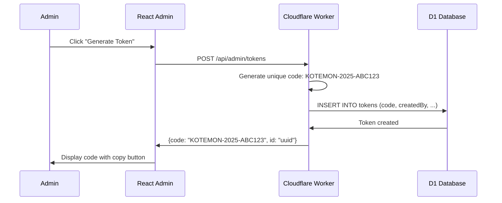
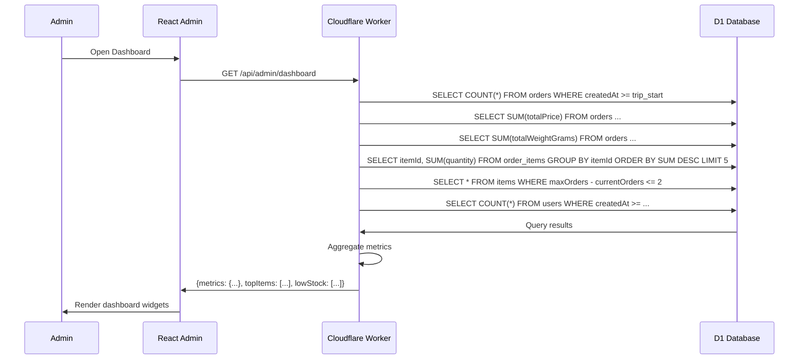
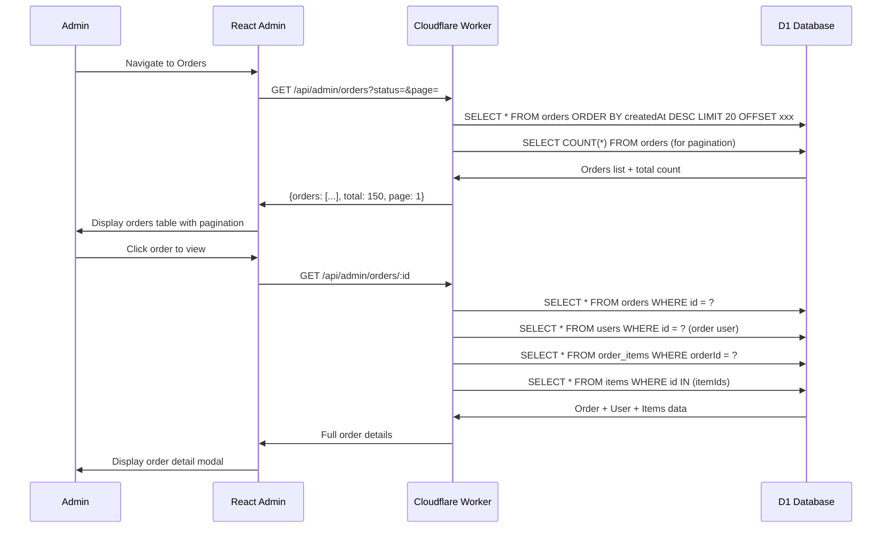

# Technical Design: Phase 3 - Admin Tools

## 1. Architectural Overview

### System Design
Extend admin panel with token management, dashboard analytics, and order management. All features are admin-only and reuse existing data from Phases 1 and 2.

### Key Decisions

| Decision | Rationale |
|----------|-----------|
| **Server-side Aggregation** | Calculate metrics in Worker (not client) for performance |
| **Token Code Format** | Human-readable: "KOTEMON-YYYY-XXXXXX" (6 random chars) |
| **CSV Export** | Client-side generation from JSON data (no server template needed) |
| **Soft Revoke** | Tokens marked revoked, not deleted (audit trail) |

### New Components
- Token generation and management
- Dashboard metrics widgets
- Order management interface
- Data export utilities

---

## 2. Data Flow Diagram

### Token Generation Flow


### Dashboard Metrics Flow


### Order Management Flow


---

## 3. Component & Interface Definitions

### TypeScript Interfaces (Admin Views)

```typescript
// Token (Admin View)
interface AdminToken {
  id: string;
  code: string; // KOTEMON-YYYY-XXXXXX
  status: 'active' | 'used' | 'expired' | 'revoked';
  createdBy: string;
  createdAt: string;
  expiresAt: string | null;
  usedBy: {
    userId: string;
    name: string;
    email: string;
    usedAt: string;
  } | null;
}

// Dashboard Metrics
interface DashboardMetrics {
  tripStatus: {
    isOpen: boolean;
    daysUntilClose: number | null;
    quotaUsedKg: number;
    quotaTotalKg: number;
    quotaPercentage: number;
  };
  orderSummary: {
    totalOrders: number;
    totalRevenue: number;
    averageOrderValue: number;
  };
  topItems: {
    itemId: string;
    name: string;
    photo: string;
    totalOrdered: number;
  }[];
  lowStockItems: {
    itemId: string;
    name: string;
    availableSlots: number;
    maxOrders: number;
  }[];
  userStats: {
    totalUsers: number;
    newUsersThisWeek: number;
  };
}

// Order (Admin View)
interface AdminOrder {
  id: string;
  user: {
    id: string;
    name: string;
    email: string;
    photoUrl: string;
  };
  items: {
    itemId: string;
    name: string;
    photo: string;
    quantity: number;
    priceAtTime: number;
    weightAtTime: number;
  }[];
  totalWeightGrams: number;
  totalPrice: number;
  status: 'Confirmed' | 'Purchased' | 'Shipped' | 'Delivered';
  createdAt: string;
}

// Token Generation Request
interface GenerateTokenRequest {
  expiresAt?: string; // ISO date, optional
}
```

### React Components (Admin)

```typescript
// Token Management
- TokenListPage: Table with filters (Active, Used, Expired, Revoked)
- TokenGenerator: Button + optional expiration + display result
- TokenCard: Code display with copy button, status badge
- TokenDetailModal: Full token info including user who used it

// Dashboard
- DashboardPage: Grid of metric widgets
- QuotaWidget: Progress bar with kg used/total
- OrderSummaryWidget: Total orders, revenue, avg value
- TopItemsWidget: Horizontal list of top 5 items
- LowStockAlertWidget: Yellow/orange alerts for low stock
- UserGrowthWidget: Total users + new this week

// Order Management
- OrderListPage: Table with filters, search, pagination
- OrderFilters: Status dropdown, date range, search input
- OrderDetailModal: Full order with user profile and items
- OrderStatusUpdater: Dropdown to change status (Confirmed → Purchased → Shipped → Delivered)
- ExportButton: CSV export for orders/tokens

// User Management
- UserListPage: Table of users with order counts
- UserDetailModal: Profile + full order history
```

---

## 4. API Endpoint Definitions

### Token Management Endpoints (Admin Auth Required)

#### POST /api/admin/tokens
**Body:** `{ expiresAt?: string }`
**Response:**
```json
{
  "success": true,
  "data": {
    "id": "uuid",
    "code": "KOTEMON-2025-ABC123",
    "status": "active",
    "createdAt": "2025-01-31T10:00:00Z"
  }
}
```

#### GET /api/admin/tokens
**Query:** `?status=active|used|expired|revoked&page=1`
**Response:**
```json
{
  "success": true,
  "data": {
    "tokens": [...],
    "total": 45,
    "page": 1
  }
}
```

#### PATCH /api/admin/tokens/:id/revoke
**Response:** `{ success: true }`

### Dashboard Endpoints (Admin Auth Required)

#### GET /api/admin/dashboard
**Response:**
```json
{
  "success": true,
  "data": {
    "tripStatus": { ... },
    "orderSummary": { ... },
    "topItems": [...],
    "lowStockItems": [...],
    "userStats": { ... }
  }
}
```

### Order Management Endpoints (Admin Auth Required)

#### GET /api/admin/orders
**Query:** `?status=&userId=&fromDate=&toDate=&search=&page=1`
**Response:** Paginated list of orders with user summary

#### GET /api/admin/orders/:id
**Response:** Full order details with user and items

#### PATCH /api/admin/orders/:id/status
**Body:** `{ status: 'Purchased' | 'Shipped' | 'Delivered' }`
**Response:** Updated order

### User Management Endpoints (Admin Auth Required)

#### GET /api/admin/users
**Query:** `?search=&page=1`
**Response:** Paginated list of users with order counts

#### GET /api/admin/users/:id
**Response:** User profile + order history

---

## 5. Database Schema (Phase 3 uses existing, no changes)

No new tables — Phase 3 uses existing tables from Phases 1 and 2:
- `settings` (Phase 1)
- `items` (Phase 1)
- `users` (Phase 2)
- `tokens` (Phase 2)
- `orders` (Phase 2)
- `order_items` (Phase 2)

### Indexes for Admin Queries

Already defined in previous phases:
- `idx_orders_created_at` — For order list sorting
- `idx_orders_status` — For status filtering
- `idx_tokens_status` — For token status filtering
- `idx_users_created_at` — For new users query

---

## 6. Security Considerations

### Admin Endpoint Protection
- All `/api/admin/*` endpoints require admin password (same as Phase 1)
- Additional check: Verify user is admin (can add `isAdmin` flag to settings or check hardcoded admin email)

### Token Code Generation
- Format: `KOTEMON-${YEAR}-${RANDOM6}`
- Random: Cryptographically secure random (Worker crypto API)
- Uniqueness: Database UNIQUE constraint on code

### Data Access
- Admin can see all users, orders, tokens
- No PII masking in admin view (admin owns the data)
- Order exports include all fields (admin's own data)

### Export Security
- CSV generated client-side from API response (no server file creation)
- No sensitive data in exports (just business data)

---

## 7. Test Strategy

### Unit Tests

**Token Generation:**
- Validate code format (KOTEMON-YYYY-XXXXXX)
- Validate uniqueness constraint
- Validate expiration logic

**Dashboard Metrics:**
- Validate aggregation queries
- Validate percentage calculations
- Validate top items ranking

**Order Status Updates:**
- Validate status transition logic
- Prevent invalid transitions (e.g., Delivered → Confirmed)

### Integration Tests

**API Endpoints:**
- Token CRUD operations
- Dashboard metrics accuracy
- Order filtering and search
- User retrieval

**CSV Export:**
- Validate CSV format
- Validate all rows included

### E2E/UI Tests

**Admin Flows:**
- Generate token → Copy → Verify in list
- View dashboard → Click metric → Navigate to details
- Filter orders by status → View detail → Update status
- Export orders to CSV

---

## 8. Token Code Algorithm

```typescript
function generateTokenCode(): string {
  const year = new Date().getFullYear();
  const chars = 'ABCDEFGHIJKLMNOPQRSTUVWXYZ0123456789';
  let random = '';
  
  // Generate 6 random characters
  const array = new Uint8Array(6);
  crypto.getRandomValues(array);
  
  for (let i = 0; i < 6; i++) {
    random += chars[array[i] % chars.length];
  }
  
  return `KOTEMON-${year}-${random}`;
}

// Examples: KOTEMON-2025-ABC123, KOTEMON-2025-X7K9M2
```

---

## 9. Deployment Notes

### Phase 3 Migration
1. Deploy new Worker code (admin endpoints)
2. Update React admin panel with new features
3. No database migration needed (uses existing tables)
4. Test token generation and dashboard
5. Deploy to production

### Backward Compatibility
- Phase 3 is purely additive to admin panel
- Public APIs unchanged
- Phase 1 and 2 functionality unaffected
